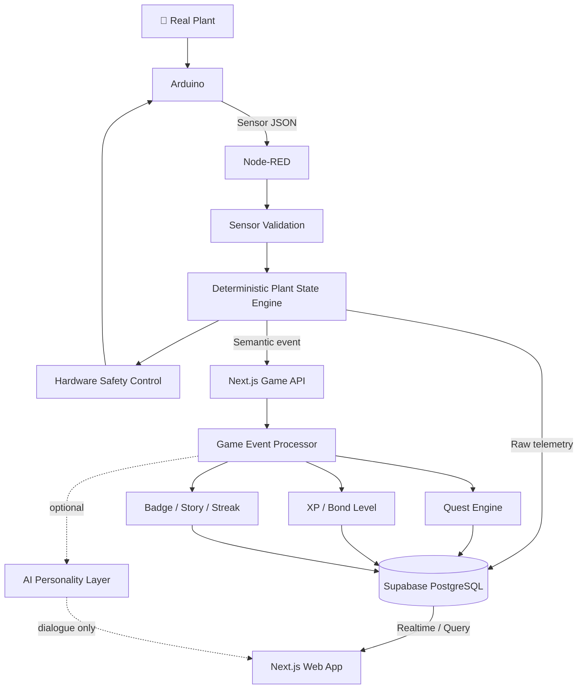

<div align="center">

# 🌱 PlantMoji

### Turn real plant care into a sensor-verified learning game.

**An AI Plant Companion that connects real-world plant sensors, gamified care quests, and data-driven learning.**


**Number One Team · Jember, Indonesia / POLIJE x KNU WFK IT Program · **

</div>

---

## ✨ What is PlantMoji?

**Meet Jamkachu 🌱 — PlantMoji's first plant companion, named after Jember.**

PlantMoji is a **Tamagotchi-inspired educational smart farming companion**.

Instead of showing only raw values such as temperature, humidity, light, and soil pH, PlantMoji translates real sensor data into an understandable **plant mood**, gives the user a **care quest**, verifies the user's real-world action through sensors, and rewards successful care with **XP, Bond Levels, badges, and story progression**.

> **The real plant becomes the game.**

The goal is not to replace traditional agricultural knowledge.

> **We are not replacing traditional farming wisdom.  
> We are making it measurable, teachable, and sustainable.**

---

## 💡 Why We Built It

A great deal of agricultural knowledge is learned through years of experience, observation, intuition, and advice from senior farmers. That knowledge is valuable, but it can be difficult to **record, measure, standardize, and transfer** to younger generations.

PlantMoji explores a bridge between:

```text
Traditional experience
        +
Measurable sensor data
        +
Interactive learning
        ↓
More teachable agricultural knowledge
```

---

## 🎮 Core Experience

```text
Sense → Understand → Act → Verify → Reward → Grow
```

Example:

```text
🌱 Jamkachu is Happy
      ↓
Temperature rises
      ↓
🔥 Jamkachu is Overheating
      ↓
NEW QUEST — Cool Me Down
      ↓
User improves the environment
      ↓
Sensors verify recovery
      ↓
✅ Quest Complete
      ↓
+30 XP
      ↓
✨ Bond Level Up
```

Unlike a normal mobile game, quest completion depends on a **real improvement in the plant's environment**.

---

## 😊 Plant Mood System

| Mood | Meaning |
|---|---|
| 😊 **Happy** | Environment is within the preferred range |
| 🥵 **Overheating** | Temperature is too high |
| 😵 **Dry Air** | Air humidity is too low |
| 😴 **Sleepy** | Light level is insufficient |
| 🤢 **Soil Acidic** | Soil pH is below the preferred range |
| 😖 **Soil Alkaline** | Soil pH is above the preferred range |

> DHT11 humidity is treated as **air humidity**, not soil moisture.

Jamkachu is **one character with seven faces**: the six mood faces above plus a closed-eyes **night sleep** face. Between **18:00 and 06:00 WIB**, a Happy Jamkachu sleeps — slow breathing, a sleep bubble, and light shown as "Night 🌙" instead of a problem. Problem moods **always override sleep**, so safety stays visible.

Temporary game emotions — **Excited**, **Proud**, **Curious**, **Recovering** — layer on top for events such as Level Up, Quest Complete, and Story Unlock (implemented in `src/game/emotions/`).

---

## 🕹️ Gamification

### Care Quests

| Quest | Trigger / Goal | Reward |
|---|---|---:|
| 🌱 **Keep Me Happy** | Stay healthy for 30 minutes | +20 XP |
| 🛋️ **Stay Comfy** | Stay in the comfort zone for 2 hours | +40 XP |
| ❄️ **Cool Me Down** | Recover from overheating (≤26 °C) and stay stable 5 min | +30 XP |
| ☀️ **Give Me More Light** | Restore sufficient light and stay stable 5 min | +20 XP |
| 💦 **Humidify My Air** | Recover air humidity (≥45%) and stay stable 5 min | +20 XP |
| 🧪 **Balance My Soil** (acidic) | Bring soil pH back into range and stay stable 5 min | +25 XP |
| 🧪 **Balance My Soil** (alkaline) | Bring soil pH back into range and stay stable 5 min | +25 XP |

Quest completion is **sensor-verified**. A user cannot simply tap “Done” to receive the reward.

🍀 **Lucky Sprout ×2** — roughly **1 in 8** quest completions doubles the reward with a bonus XP award. The roll is a **deterministic server-side hash** of the quest id (replay-safe, idempotent, strictly additive — never a loss), and the odds are disclosed honestly inside the app's Collection help.

### Bond Level

```text
0–14 XP  → Bond Lv.1
15–29 XP → Bond Lv.2
30–44 XP → Bond Lv.3
...
```

Every level uses a flat **15 XP step** (`XP_PER_LEVEL` in `src/types/game.ts`,
mirrored by the `award_xp` RPC). Early levels arrive quickly and later levels
do not turn into a grind; the XP bar animates the real ledger change.

Bond Level represents care and progression. It is intentionally separate from the plant's real biological **Growth Stage**.

### Progression Systems (all implemented)

- 🔥 **Care Streak** — consecutive qualifying-care days, counted in WIB (Asia/Jakarta); streak milestones at 3/7/14/30 days award bonus XP
- 🏅 **Badges** — 12 child-friendly badges (First Help, Light Helper, Cool Helper, Happy Soil, Air Helper, Mood Finder, Quest Star, Plant Writer, care & friendship milestones…), each +15 bonus XP
- 📖 **Story Chapters** — 6 chapters set in Jember with per-personality dialogue, from *First Meeting in Jember* to *Harvest of Wisdom*; each unlock +25 bonus XP
- 📚 **Collection Book** — Moods (with plant-science "why" cards), Badges, Story, and Farmer Wisdom tabs; locked badges render as **dark silhouettes with honest hints** and flip open live (realtime) when earned
- 📊 **Weekly Report** — healthy time, quests completed, streak, an AI-narrated (template-fallback) summary, and an animated count-up recap
- 🎉 **Seasonal Events** — date-window XP multipliers: Musim Kemarau Heat Challenge (×1.2), Weekend Growth (×1.1), Musim Hujan Growing Season (×1.15, Nov–Apr); highest multiplier wins, never stacked
- 🎲 **Daily Events** — one deterministic event per WIB day per plant (hash-picked, replay-safe): Jember-flavored XP boosts (*Golden Hour over the Sawah* ×1.5), care challenges (+10–15 XP, ledger-guarded), and flavor days (*Carnaval Day*, *Market Morning*, *Volcano-Soil Pride Day*…)
- 🤖 **AI-personalized dialogue** — optional Gemini-powered grounded explanations; always falls back to deterministic templates
- 🐣 **Companion Evolution** — a 10-stage ladder (Seed → Sprout → Seedling → Bud → Bloom → Fruit → Guardian → Elder → Radiant → Legend, milestone16), calculated only from completed sensor-verified care with an honest next-stage progress line; care affinity changes the virtual form while the real plant's manually logged Growth Stage remains separate
- 🧠 **Farm Case Quiz** — endless three-step agriculture cases (*Observe → Understand → Act*) with a 15-second timer, a first-miss hint, answer/explanation after another miss, +1–3 XP for a correct answer, and −1 XP for a miss/timeout
- 🌾 **1,800+ dialogue variants** — short ID/EN lines grounded in mood, time, companion stage (all ten), event, and the selected Jamkachu personality, with repetition control and deterministic fallback
- 💎 **Playable collection rewards** — discovered Moods perform character reactions, Stories replay as pixel scenes, Badges can preview and change home tap effects, and Wisdom cards open sensor-prediction practice

### Tamagotchi Continuity

The relationship with Jamkachu continues even after you step away:

- 🐣 **Hatching intro** — one-time first visit (skippable, reduced-motion-safe): the pot trembles, Jamkachu pops out with confetti, and the four sensors are introduced in plain words
- 🧭 **First-day tour + honest waiting states** — right after hatching, a one-time 4-step spotlight tour (skippable, reduced-motion-safe) walks through mood, quest slot, care button, and sensor tiles; until an Arduino has ever reported, the tiles show an honest "sensors aren't connected yet" state and the empty quest slot explains that quests begin with real sensor data. Display-only: zero writes, zero XP
- 🌳 **Contextual care button** — replaces the old WATER / FERTILIZE buttons. There is no soil-moisture or nutrient sensor, so those buttons could teach children the *wrong* action (low **air** humidity must never prompt watering the soil). One mood-driven button shows the single safe action — "Move me to shade 🌳", "Show me some light ☀️", "Check my soil with a teacher 🧑‍🏫" — with a why-card tying it to the sensor that will verify it. Zero XP
- 😴 **Night sleep mode** — 18:00–06:00 WIB (see Plant Mood System above); no streak loss, no guilt copy at night
- 🏡 **Level decorations** — Bond levels leave visible traces on the mascot stage: Lv.2 pot sticker, Lv.3 flag, Lv.5 room glow, Lv.7 ribbon, Lv.10 golden pot + best-friend token. Pure presentation, re-derived from the bond level on every render
- 👒 **Jember crop skin wardrobe** — seven cosmetic looks for Jamkachu, each a Jember crop, unlocked by Bond Level: Classic Jamkachu (Lv.1, always yours) → Edamame Buddy (Lv.2) → Golden Rice (Lv.4) → Sweet Corn (Lv.6) → Robusta Coffee (Lv.8) → Cacao Pod (Lv.10) → Dragon Fruit (Lv.12). Display-only by design: a skin changes how Jamkachu is drawn and nothing else — it never grants or gates XP, Seeds, quests, evolution, or sensors
- 💭 **Jamkachu remembers** — template sentences built from recent care history ("Yesterday you helped me cool down!") rotate into the idle speech bubble, at most one per hour. No AI call
- 🥰 **Petting** — tap the mascot for a bounce, heart pixel, and a personality line. In-fiction only: no counters, no achievements, zero XP

### Reward Feedback (the dopamine layer)

Celebrations are real, quick, and honest — every effect fires only on backend-verified transitions:

- 🎚️ **Celebration queue** — stacked FX (quest + lucky + level-up) play as an ordered sequence with per-tier duration caps, so feedback never blocks information
- 🔊 **8-bit SFX** — synthesized live with WebAudio (zero audio files), sound on by default (spec D1) with a persistent one-tap mute (`localStorage` `pm_sound`) synced across pages; haptics follow the same preference
- 🌰 **Tap-to-claim reward pod** — a quest completion drops a seed pod by Jamkachu; tap it to pop the celebration (it auto-bursts after ~8 s so nothing ever stalls)
- ✨ **XP orb cascade** — awards split into orbs that arc into the XP bar (gold when lucky); reduced-motion collapses to a single count-up
- 🔍 **Verifying shimmer** — quests being sensor-checked render amber with "Sensor is checking…", then a short anticipation hold before the celebration
- 💬 **Reason chips** — every XP gain is labeled live from realtime events: "+30 XP · Quest complete", "LUCKY! ×2"
- 🌊 **Causal echo** — when a sensor visibly improves between readings, a chip on the environment strip connects the user's care to the data
- 🔥 **Streak keeper** — at most once per day, 07:00–20:00 only, with warm copy; a broken streak gets a kind restart message
- 📖 **Chapter gate** — chapter unlocks are the peak moment: theme jingle, full-screen pixel vignette, tap-through dialogue

### Ethics Guardrails (non-negotiable)

Built for teenagers, so the dopamine layer is honest by design:

1. Physical-care XP comes only from sensor-verified quests. Taps, petting, cosmetic previews, and care buttons grant **zero XP**; the separately labeled agriculture quiz can award +1–3 XP or deduct exactly 1 XP
2. The Lucky bonus is **strictly additive** with disclosed 1-in-8 odds — no near-miss theatrics, no grind loops
3. No countdown pressure, no guilt copy, no fake scarcity; streak messaging is warm and daytime-only
4. Celebrations have total-duration caps, honor `prefers-reduced-motion`, and mute is always one tap away
5. Presenter hotkeys are presentation-only replays (zero data writes) and are disclosed to producers

Quiz scoring is deliberately small compared with verified care, and every
question teaches environmental observation or safe agricultural action. Soil
pH questions never prescribe chemical dosage and direct students to a teacher
or experienced adult.

---

## 🧠 Personality System

Implemented personalities (stored per plant, used across dialogue and story):

- 🥰 Cute
- 😌 Calm
- 😆 Funny
- ⚡ Energetic
- 🙈 Shy

Example — **Overheating**:

```text
Cute
"It's too hot... please help me!"

Calm
"The temperature is above my preferred range."

Funny
"Who turned my pot into a sauna? 🔥"

Energetic
"Too hot! Let's cool down!"

Shy
"Um... could I have a little shade?"
```

The plant diagnosis remains deterministic. Personality changes only **how the message is expressed**.

---

## 🏗️ System Architecture



### Responsibility Boundaries

| Layer | Responsibility |
|---|---|
| **Arduino** | Read sensors and execute physical commands |
| **Node-RED** | Validate sensors, determine plant state, control hardware safely |
| **Next.js Game Engine** | Quest, XP, Bond Level, Streak, Badge, Story |
| **Supabase** | Persistent source of truth |
| **Web App** | User-facing plant companion experience |
| **AI Layer** | Optional wording, personality, explanation |

> **AI never controls hardware or determines physical truth.**

### Environment Intelligence

The Jember Crop Explorer reuses one deterministic Environment Analyzer:

```text
Latest real sensor snapshot + versioned Jember crop profiles
                         ↓
            deterministic match / mismatch
                         ↓
     Scan This Place · Crop Match · What Should I Change?
                         ↓
        optional short Gemini explanation or local fallback
```

- Compares temperature, **air** humidity, light, and calibrated soil pH.
- Reports transparent counts such as `3 / 4 measured conditions matched`;
  missing or malformed values are `not_evaluated`, never mismatches.
- Ranking is deterministic. Gemini never ranks crops or invents thresholds.
- Draft and `reference_only` Jember profiles are visibly advisory. Only an
  approved profile can affect the automatic mood and quest engine.
- Recommendations are reversible and educational. Soil intervention is
  referred to a teacher/farmer rather than giving chemical dosage.
- `GEMINI_API_KEY` and `gemini-3.5-flash-lite` are server-side only. Missing
  keys, rate limits, malformed output, and timeouts always use deterministic
  bilingual fallback copy.

---

## 🔒 Safety-First Design

If the internet, database, web app, or AI becomes unavailable, local control must continue:

```text
Arduino + Node-RED
        ↓
Sensor validation
        ↓
Plant state
        ↓
Servo / LCD / RGB / Buzzer
```

AI may assist with dialogue and explanation, but it does **not** decide:

- servo angle
- sensor validity
- hardware safety commands
- chemical dosage
- quest completion truth
- XP rewards

---

## 🔧 Hardware

### Sensors

- DHT11 — temperature + air humidity
- LDR — calibrated relative light level (0–100%; operational Low boundary at 30%)
- Soil pH sensor

### Outputs / Actuators

- Servo motor — ventilation mechanism
- 16×2 I2C LCD
- RGB LED
- Buzzer

### Example Sensor Payload

```json
{
  "temperature": 27.4,
  "humidity": 61,
  "light": 65,
  "soilPH": 6.5
}
```

> `soilPH` must be a calibrated pH value, not a raw ADC reading.

---

## 🧩 Tech Stack

| Area | Technology |
|---|---|
| Hardware | Arduino |
| Firmware | Arduino C/C++ |
| IoT / Edge Logic | Node-RED |
| Frontend | Next.js + React |
| Language | TypeScript |
| Styling | Tailwind CSS |
| Game Logic | TypeScript |
| Database | Supabase PostgreSQL |
| Realtime | Supabase Realtime |
| Sound | 8-bit SFX synthesized in WebAudio *(zero audio files)* |
| UI languages | Bahasa Indonesia (default) · English |
| AI | Gemini API (`gemini-3.5-flash-lite`), server-side only *(optional — deterministic template fallback)* |
| Testing / CI | Vitest + GitHub Actions (lint · test · build) |
| Deployment | Vercel + Supabase Cloud |

---

## 🌐 Web App

Live screens:

```text
/            Home — the "Cozy Pixel Farm" page, character-first and bound to
             live data. Top-to-bottom hierarchy (sensors intentionally LAST):
             ├── JAMKACHU — one character, 7 faces (6 moods + night sleep),
             │   idle blink & sway, level decorations Lv.2–10,
             │   one-time hatching intro, pettable (zero XP)
             ├── Speech bubble — AI/template mood dialogue + rotated memories
             ├── Current Quest slot — live progress + amber verifying shimmer
             ├── Bond Level · XP · HP · Care Streak (tappable streak flame)
             ├── Contextual care button — the one safe action for the mood
             └── Environment strip: Temp · Humidity · Light · pH, each value
                 tappable for Jamkachu's commentary; BMKG Jember outdoor
                 forecast stays separate from the indoor sensor
             Reward FX ride the celebration queue: tap-to-claim reward pod,
             XP orb cascade, reason chips, causal echo, Lucky ×2 stamp,
             chapter gate — with 8-bit WebAudio SFX (on by default,
             one-tap mute). Real backend-verified transitions only; reduced-motion
             safe.

/quests      Active & past quests, live quest celebrations, verifying
             shimmer, "Today's Event" banner (daily events)
/collection  Playable Collection — Mood reactions · circular badge/gem path
             and tap-effect previews · Story pixel replay · Wisdom sensor quiz
/reports     Weekly Report — animated count-up recap
/monitoring  "Plant Status" — semicircle gauges (temp / humidity / soil
             moisture) + light (lux) history chart, 10 s polling
/plants      Jember Crop Explorer — real snapshot scan, deterministic crop
             comparison, condition detail, grounded AI/fallback explanation
/diary       Care Memories (automatic) + Growth Notes (manual real growth)
/settings    Plant name, personality, growth stage, and the classroom
             cheat sandbox / developer mode doors
```

Every React page shares the farm page's pixel design system (`pm-*` utility
classes) and framed content stage. The navigation follows a Tamagotchi game
loop instead of a dashboard: **My Garden · Care · Explore · Memories ·
Treasures**. Sensors, Recap, and Settings live in a smaller desktop Tool
Pocket; phones keep the five core game actions in a compact bottom dock.
Tab transitions use route-specific, clickable pixel Jamkachu loading toys.

The UI is **bilingual: Bahasa Indonesia by default, English via the ID / EN
switch** (persisted across pages). The farm page reads a two-locale string
table (`public/farm/strings.js`); React pages carry inline ID/EN dictionaries.

PlantMoji is designed as a **plant companion first** and a sensor dashboard second.

---

## 🚀 Getting Started

### Prerequisites

- Node.js
- npm
- Supabase project
- Node-RED
- Arduino development environment

### 1. Clone

```bash
git clone <YOUR_REPOSITORY_URL>
cd plantmoji
```

### 2. Install

```bash
npm install
```

### 3. Environment variables

Create `.env.local`:

```env
NEXT_PUBLIC_SUPABASE_URL=https://YOUR_PROJECT.supabase.co
NEXT_PUBLIC_SUPABASE_PUBLISHABLE_KEY=YOUR_PUBLISHABLE_KEY

# Server-side only — NEVER expose this in browser code.
SUPABASE_SECRET_KEY=YOUR_SECRET_KEY

# Optional — shared token for the device endpoints (/api/sensor-readings and
# /api/device-events). When set, Node-RED must send it as
# `Authorization: Bearer <value>`; when unset, the endpoints accept requests
# without auth (local prototype mode).
DEVICE_API_TOKEN=

# Optional — BMKG village code. Defaults to Tegalgede, Sumbersari, Jember.
BMKG_ADM4_CODE=35.09.21.1005

# Optional — enables the AI personality layer (server-side only). When unset,
# or when a call fails, the game always falls back to the deterministic
# personality templates.
GEMINI_API_KEY=
```

> ⚠️ Never commit `.env.local` or a Supabase secret key.

The presentation/demo mode was removed. Three doors sit at the bottom of
**`/settings`**, in the order they are meant to be met:

| Mode | For | Starts from | Writes |
|---|---|---|---|
| 🎮 **Trial Mode** | A student meeting the app for the first time | Nothing — Lv.1, no Seeds, empty collection | Browser only |
| 🎛️ **Cheat Mode** | A presenter driving a classroom demo | A copy of the real plant's progress | Browser only |
| 🛠️ **Developer Mode** (`/settings?dev=1`) | The team | The real rows | **Supabase** |

**Trial Mode** is a two-minute onboarding game. Care actions pay XP (more when
the press actually helps), a Happy Jamkachu earns +1 XP every 3s, three actions
turn an in-game day (soil work skips three at once, as it would in a real pot),
and hazard events force a mood the student has to solve. At **Bond Lv.5**
(60 XP, about 65–85 seconds of play) Cheat Mode unlocks — the level where the
seed becomes a sprout, so the unlock and a visible growth change land together.
It is the only drawing change the two-minute budget reaches; the next is Lv.11.
The gate is a celebration, **not a lock**: the Cheat
Mode button works at any time and carries the trial's progress over, because a
school demo goes wrong in a hundred ways. Rules live in
`public/farm/trial.js`, numbers in `src/game/dev/trial-constants.ts`.

Trial and Cheat share one localStorage store and one containment rule — neither
ever touches Supabase or hardware — but pull in opposite directions: cheat mode
reveals more than the plant owns, trial mode hides what it owns.

The home weather card calls `GET /api/local-context`, which proxies and caches
the official BMKG forecast for the configured `BMKG_ADM4_CODE`. BMKG is
learning context only: mood, quests, XP, and device control continue to use
the indoor sensor plus the active crop profile.

### 4. Database schema

Run the SQL files in the Supabase SQL Editor, in order (all are re-runnable):

```text
supabase/milestone1.sql               plants, device_events, RLS, realtime
supabase/milestone3.sql               bond_state, quests, badges, xp ledger, award_xp RPC
supabase/milestone4-soil-quests.sql   soil quest keys
supabase/milestone5-growth-records.sql
supabase/milestone6-crop-profiles.sql  strawberry key on plants
supabase/milestone6-monitoring.sql    soil_moisture / light_lux columns
supabase/milestone7-more-quests.sql   Humidify My Air + Stay Comfy keys
supabase/milestone8-dopamine.sql      bond_events realtime publication (reason chips, Lucky stamp)
supabase/milestone9-raw-sensor-ingest.sql     sensor_readings table (raw ingest)
supabase/milestone10-jember-crop-catalog.sql  10 Jember crops + versioned evidence / sources
supabase/milestone11-tamagotchi.sql           companion state/evolution + realtime
supabase/milestone12-selectable-crops.sql     selectable crop catalog/profile contract
supabase/milestone13-daily-quiz.sql           replay-safe quiz attempts + atomic quiz XP
supabase/milestone14-fast-levels.sql           flat 30-XP Bond Level progression
supabase/milestone15-light-percentage.sql      relative LDR 0–100% + 30% Low boundary
supabase/milestone16-evolution-ladder.sql      10-stage companion ladder + display-only progress counters
supabase/milestone17-quiz-kind-scoring.sql     quiz kind scoring — a miss awards 0 XP, never −1
supabase/milestone18-seed-shop.sql             Seed economy: seeds balance, ledger, shop + RPCs
supabase/milestone18-growth-snapshots.sql      private growth-snapshots Storage bucket (diary postcards)
supabase/milestone19-photo-diary.sql           legacy photo-diary columns (superseded by Live Guardian)
supabase/milestone19-camera-guardian.sql       Live Guardian camera_events + realtime (stores no images)
supabase/milestone20-companion-skins.sql       cosmetic crop-skin key on companion_state (display-only)
supabase/milestone21-sensor-realtime.sql        pushes sensor_readings live (drops the 15s poll wait)
```

There is no `milestone2.sql` — `milestone1.sql` covers that ground. Every
file is guarded and safe to re-run; when in doubt, run all migrations again in
order (see `docs/RUNBOOK-filming-and-golive.md` §1.2).

Milestone 10 seeds researched Jember profiles as `draft` or
`reference_only`. Strawberry remains the only profile approved for automatic
mood and quest decisions. See `docs/CROP-PROFILE-CATALOG-jember.md` before
activating another crop.

If the Supabase host is unreachable, server-side requests are capped at 2.5
seconds so route loading can fall back to an honest connection notice instead
of trapping the user on the pixel loading screen. This does not make offline
data authoritative; it only keeps navigation responsive.

### 5. Run

```bash
npm run dev
```

Open:

```text
http://localhost:3000
```

---

## 📡 Device APIs

Raw sensor readings can be ingested directly (requires `milestone9-raw-sensor-ingest.sql`):

```http
POST /api/sensor-readings
```

Payload shape, the idempotent `readingId`, and Bearer auth are documented in
`docs/API-raw-sensor-ingest.md`. The legacy `POST /api/device-events` also
accepts the same flat raw payload.

Node-RED can also send meaningful plant events to the game backend:

```http
POST /api/device-events
```

```json
{
  "eventId": "evt-001",
  "plantId": "plant-01",
  "type": "PLANT_STATE_CHANGED",
  "occurredAt": "2026-08-07T12:00:00+07:00",
  "data": {
    "previousState": "Happy",
    "currentState": "Overheating",
    "temperature": 34.2
  }
}
```

Two ingestion paths are supported:

```text
Raw sensor readings (new flow)
Node-RED → /api/sensor-readings → store sample → crop profile +
hysteresis derive the mood → Game Engine

Semantic domain event (original flow)
Node-RED determines plant state → /api/device-events → Game Engine
```

---

## 🧱 Project Structure

```text
plantmoji/
│
├── public/farm/          Pixel-farm home page (character-first)
│   ├── live.js           Live data binding + celebration queue + FX
│   ├── sfx.js            8-bit WebAudio SFX engine (shared with React pages)
│   └── strings.js        Two-locale UI string table (ID default / EN)
│
├── src/
│   ├── app/
│   │   ├── quests/ collection/ diary/ reports/ monitoring/ plants/ settings/
│   │   └── api/
│   │       ├── sensor-readings/  raw sensor ingest (idempotent readingId)
│   │       ├── device-events/    Node-RED → game engine (idempotent)
│   │       ├── sensor-history/   monitoring dashboard feed
│   │       ├── game-tick/ mood-message/ public-config/ daily-quiz/
│   │       ├── environment-scan/ environment-explanation/ crop-profile/
│   │       └── local-context/   cached BMKG outdoor forecast
│   │
│   ├── components/       shared pixel-farm shell, collection tabs, demo center…
│   ├── game/
│   │   ├── events/       event router + lazy timestamp sweep + Lucky settle
│   │   ├── quests/       sensor-verified quest engine
│   │   ├── progression/  XP · streak · bonus XP
│   │   ├── companion/ quiz/ badges/ story/ seasonal/
│   │   ├── random/       deterministic daily events (Jember pool) + Lucky hash
│   │   ├── emotions/     event emotions (Proud, Excited…)
│   │   ├── personality/  deterministic message templates
│   │   └── education/    why-cards + farmer wisdom
│   ├── lib/              i18n + environment analyzer + AI/Supabase helpers
│   └── types/
│
├── supabase/             additive SQL migrations (milestone1 … milestone20)
├── node-red/             bridge flow + trilingual guide
├── docs/                 setup + integration plans + filming/go-live runbook (EN/ID/KO)
├── tests/                315 Vitest tests across 31 suites
└── README.md
```

---

## 🗺️ Development Roadmap

### Phase 1 — Infrastructure

- [x] Hardware prototype
- [x] Node-RED plant-state architecture
- [x] Supabase persistence architecture
- [x] Next.js application skeleton
- [x] Node-RED → Next.js event API
- [x] Realtime web mood update

### Phase 2 — Core Game Loop

- [x] Quest Engine
- [x] Sensor-verified quest completion
- [x] XP Engine
- [x] Bond Level
- [x] Level Up

### Phase 3 — Game Content

- [x] Personality templates
- [x] Badge System
- [x] Story Chapters
- [x] Collection Book
- [x] Care Streak
- [x] Weekly Report
- [x] Companion Evolution separated from manual real-plant Growth Stage
- [x] Agriculture-only Farm Case quiz with hints, answer teaching and timer

### Phase 4 — Experience

- [x] Character-first pixel-farm home wired to live data (JAMKACHU hero → mood → dialogue → quest → bond → environment strip last)
- [x] Character faces & animations per mood (7 faces incl. night sleep, idle blink + sway)
- [x] Tamagotchi continuity (contextual care button, night sleep mode, hatching intro, level decorations Lv.2–10, Jamkachu memories)
- [x] Dopamine reward layer, ethically (celebration queue, 8-bit SFX, reward pod, orb cascade, reason chips, Lucky ×2, chapter gate — real verified transitions only)
- [x] Bilingual UI — Bahasa Indonesia default + English switch
- [x] Unified pixel-farm design across every React page (shared sidebar + pm-* utilities)
- [x] Sensor monitoring dashboard (/monitoring, "Plant Status")
- [x] Daily events + Jember-localized story, seasons, and wisdom
- [x] Deterministic Jember Environment Analyzer + Scan This Place + Crop Match
- [x] Server-only Gemini environment explanations with deterministic fallback
- [x] Playable Mood, Badge, Story and Wisdom collection rewards
- [x] Tamagotchi navigation (five game tabs + compact operator Tool Pocket)
- [x] Mobile navigation fix — every game tab stays reachable and tappable from the phone bottom dock
- [x] Jember crop skin wardrobe — cosmetic companion skins unlocked by Bond Level (display-only, milestone20)
- [x] Route-specific interactive pixel loading toys
- [x] AI-personalized dialogue (optional, template fallback)
- [x] Seasonal Events
- [x] Growth Records (manual, settings page — never inferred from sensors)
- [x] Weather integration — BMKG Jember forecast as learning context
- [ ] Deeper onboarding & plain-language layer (see docs/PLAN-gameplay-usability.md)

### Phase 5 — Future Research

- [ ] Camera-based growth tracking
- [ ] Computer vision
- [ ] Multi-plant profiles
- [ ] Multi-device deployment

---

## 🎬 Demo Scenario

```text
1. Jamkachu is Happy
2. Temperature rises
3. Node-RED detects Overheating
4. Servo / RGB / LCD react locally
5. Jamkachu's face flips to Overheating 🥵
6. "Cool Me Down" quest appears; the care button says "Move me to shade 🌳"
7. User improves the environment
8. Causal-echo chip on the gauge; quest turns VERIFYING ("Sensor is checking…")
9. Quest completes — a reward pod drops; tap it
10. XP orbs cascade into the bar (+30 XP · sometimes LUCKY! ×2)
11. Bond Level Up → a new level decoration appears on the mascot stage
12. Hardware + Web celebrate together
13. Open Explore, scan the same real snapshot, compare Jember crop references,
    and ask for a grounded explanation of the largest measured mismatch
```

This demonstrates the full loop:

> **real-world sensing → care → verification → game progression**

For go-live, follow `docs/RUNBOOK-filming-and-golive.md` (EN / ID / KO):
environment variables, migration verification, and the QA checklist. Its
presenter-hotkey sections describe the removed presentation mode and no
longer apply.

---

## 🌏 Our Vision

PlantMoji is about more than monitoring a plant.

We want to explore how technology can help make agricultural knowledge:

- measurable,
- understandable,
- teachable,
- engaging,
- sustainable across generations.

> **Preserve the wisdom of the past.  
> Teach with the technology of today.  
> Grow the farmers of tomorrow.**

---

<div align="center">

### 🌱 PlantMoji

**Take care of the real plant.  
Grow the virtual companion.  
Build the bond together.**

Made by **Number One Team** during the **WFK IT Program** in Jember, Indonesia.

</div>

