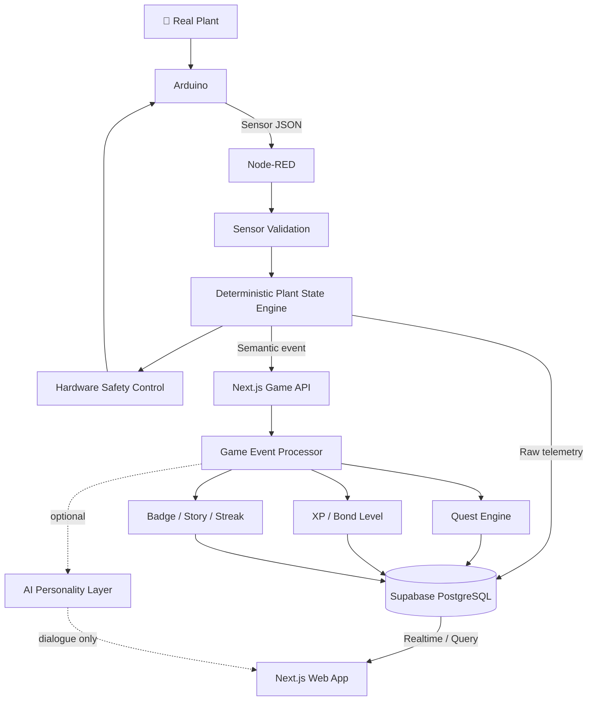

<div align="center">

# 🌱 PlantMoji

### Turn real plant care into a sensor-verified learning game.

**An AI Plant Companion that connects real-world plant sensors, gamified care quests, and data-driven learning.**


**Number One Team · Jember, Indonesia / POLIJE x KNU WFK IT Program · **

</div>

---

## ✨ What is PlantMoji?

**Meet Jamkachu 🌱 — PlantMoji's first plant companion, named after Jember.**

PlantMoji is a **Tamagotchi-inspired educational smart farming companion**.

Instead of showing only raw values such as temperature, humidity, light, and soil pH, PlantMoji translates real sensor data into an understandable **plant mood**, gives the user a **care quest**, verifies the user's real-world action through sensors, and rewards successful care with **XP, Bond Levels, badges, and story progression**.

> **The real plant becomes the game.**

The goal is not to replace traditional agricultural knowledge.

> **We are not replacing traditional farming wisdom.  
> We are making it measurable, teachable, and sustainable.**

---

## 💡 Why We Built It

A great deal of agricultural knowledge is learned through years of experience, observation, intuition, and advice from senior farmers. That knowledge is valuable, but it can be difficult to **record, measure, standardize, and transfer** to younger generations.

PlantMoji explores a bridge between:

```text
Traditional experience
        +
Measurable sensor data
        +
Interactive learning
        ↓
More teachable agricultural knowledge
```

---

## 🎮 Core Experience

```text
Sense → Understand → Act → Verify → Reward → Grow
```

Example:

```text
🌱 Jamkachu is Happy
      ↓
Temperature rises
      ↓
🔥 Jamkachu is Overheating
      ↓
NEW QUEST — Cool Me Down
      ↓
User improves the environment
      ↓
Sensors verify recovery
      ↓
✅ Quest Complete
      ↓
+30 XP
      ↓
✨ Bond Level Up
```

Unlike a normal mobile game, quest completion depends on a **real improvement in the plant's environment**.

---

## 😊 Plant Mood System

| Mood | Meaning |
|---|---|
| 😊 **Happy** | Environment is within the preferred range |
| 🔥 **Overheating** | Temperature is too high |
| 💨 **Dry Air** | Air humidity is too low |
| 🌙 **Sleepy** | Light level is insufficient |
| 🧪 **Soil Acidic** | Soil pH is below the preferred range |
| 🧪 **Soil Alkaline** | Soil pH is above the preferred range |

> DHT11 humidity is treated as **air humidity**, not soil moisture.

Temporary game emotions such as **Excited**, **Proud**, and **Curious** may be used for events such as Level Up, Quest Complete, and Story Unlock.

---

## 🕹️ Gamification

### Care Quests

| Quest | Trigger / Goal | Reward |
|---|---|---:|
| ☀️ **Keep Me Happy** | Stay healthy for 30 minutes | +20 XP |
| 🔥 **Cool Me Down** | Recover from overheating and remain stable | +30 XP |
| 💡 **Give Me More Light** | Restore sufficient light and remain stable | +20 XP |

Quest completion is **sensor-verified**. A user cannot simply tap “Done” to receive the reward.

### Bond Level

```text
0–99 XP    → Bond Lv.1
100–199 XP → Bond Lv.2
200–299 XP → Bond Lv.3
...
```

Bond Level represents care and progression. It is intentionally separate from the plant's real biological **Growth Stage**.

### Planned Progression

- 🔥 Care Streak
- 🏅 Badges
- 📖 Story Chapters
- 📚 Collection Book
- 📊 Weekly Report
- 🎉 Seasonal Events
- 🤖 AI-personalized dialogue

---

## 🧠 Personality System

Planned personalities:

- 🥰 Cute
- 😌 Calm
- 😆 Funny
- ⚡ Energetic
- 🙈 Shy

Example — **Overheating**:

```text
Cute
"It's too hot... please help me!"

Calm
"The temperature is above my preferred range."

Funny
"Who turned my pot into a sauna? 🔥"

Energetic
"Too hot! Let's cool down!"

Shy
"Um... could I have a little shade?"
```

The plant diagnosis remains deterministic. Personality changes only **how the message is expressed**.

---

## 🏗️ System Architecture



### Responsibility Boundaries

| Layer | Responsibility |
|---|---|
| **Arduino** | Read sensors and execute physical commands |
| **Node-RED** | Validate sensors, determine plant state, control hardware safely |
| **Next.js Game Engine** | Quest, XP, Bond Level, Streak, Badge, Story |
| **Supabase** | Persistent source of truth |
| **Web App** | User-facing plant companion experience |
| **AI Layer** | Optional wording, personality, explanation |

> **AI never controls hardware or determines physical truth.**

---

## 🔒 Safety-First Design

If the internet, database, web app, or AI becomes unavailable, local control must continue:

```text
Arduino + Node-RED
        ↓
Sensor validation
        ↓
Plant state
        ↓
Servo / LCD / RGB / Buzzer
```

AI may assist with dialogue and explanation, but it does **not** decide:

- servo angle
- sensor validity
- hardware safety commands
- chemical dosage
- quest completion truth
- XP rewards

---

## 🔧 Hardware

### Sensors

- DHT11 — temperature + air humidity
- LDR — light detection
- Soil pH sensor

### Outputs / Actuators

- Servo motor — ventilation mechanism
- 16×2 I2C LCD
- RGB LED
- Buzzer

### Example Sensor Payload

```json
{
  "temperature": 27.4,
  "humidity": 61,
  "light": 1,
  "soilPH": 6.5
}
```

> `soilPH` must be a calibrated pH value, not a raw ADC reading.

---

## 🧩 Tech Stack

| Area | Technology |
|---|---|
| Hardware | Arduino |
| Firmware | Arduino C/C++ |
| IoT / Edge Logic | Node-RED |
| Frontend | Next.js + React |
| Language | TypeScript |
| Styling | Tailwind CSS |
| Game Logic | TypeScript |
| Database | Supabase PostgreSQL |
| Realtime | Supabase Realtime |
| AI | Server-side API *(planned)* |
| Deployment | Vercel + Supabase Cloud *(planned)* |

---

## 🌐 Web App

PlantMoji is being developed as a **mobile-first web app**.

Planned main screens:

```text
Home
├── Plant Character
├── Mood
├── Bond Level
├── XP
├── Current Quest
└── Care Streak

Quest
Collection
Weekly Report
Settings
```

PlantMoji is designed as a **plant companion first** and a sensor dashboard second.

---

## 🚀 Getting Started

### Prerequisites

- Node.js
- npm
- Supabase project
- Node-RED
- Arduino development environment

### 1. Clone

```bash
git clone <YOUR_REPOSITORY_URL>
cd plantmoji
```

### 2. Install

```bash
npm install
```

### 3. Environment variables

Create `.env.local`:

```env
NEXT_PUBLIC_SUPABASE_URL=https://YOUR_PROJECT.supabase.co
NEXT_PUBLIC_SUPABASE_PUBLISHABLE_KEY=YOUR_PUBLISHABLE_KEY

# Server-side only — NEVER expose this in browser code.
SUPABASE_SECRET_KEY=YOUR_SECRET_KEY
```

> ⚠️ Never commit `.env.local` or a Supabase secret key.

### 4. Run

```bash
npm run dev
```

Open:

```text
http://localhost:3000
```

---

## 📡 Device Event API

Node-RED sends meaningful plant events to the game backend.

```http
POST /api/device-events
```

```json
{
  "eventId": "evt-001",
  "plantId": "plant-01",
  "type": "PLANT_STATE_CHANGED",
  "occurredAt": "2026-08-07T12:00:00+07:00",
  "data": {
    "previousState": "Happy",
    "currentState": "Overheating",
    "temperature": 34.2
  }
}
```

Data paths are intentionally separated:

```text
Raw sensor telemetry
Node-RED → Supabase

Meaningful domain event
Node-RED → Next.js Game API → Game Engine
```

---

## 🧱 Project Structure

```text
plantmoji/
│
├── src/
│   ├── app/
│   │   ├── page.tsx
│   │   ├── quests/
│   │   ├── collection/
│   │   ├── reports/
│   │   ├── settings/
│   │   └── api/
│   │       └── device-events/
│   │
│   ├── components/
│   ├── game/
│   │   ├── events/
│   │   ├── quests/
│   │   ├── progression/
│   │   ├── badges/
│   │   ├── story/
│   │   └── seasonal/
│   ├── lib/
│   │   └── supabase/
│   └── types/
│
└── README.md
```

---

## 🗺️ Development Roadmap

### Phase 1 — Infrastructure

- [x] Hardware prototype
- [x] Node-RED plant-state architecture
- [x] Supabase persistence architecture
- [ ] Next.js application skeleton
- [ ] Node-RED → Next.js event API
- [ ] Realtime web mood update

### Phase 2 — Core Game Loop

- [ ] Quest Engine
- [ ] Sensor-verified quest completion
- [ ] XP Engine
- [ ] Bond Level
- [ ] Level Up

### Phase 3 — Game Content

- [ ] Personality templates
- [ ] Badge System
- [ ] Story Chapters
- [ ] Collection Book
- [ ] Care Streak
- [ ] Weekly Report

### Phase 4 — Experience

- [ ] UI/UX polish
- [ ] Character animations
- [ ] AI-personalized dialogue
- [ ] Seasonal Events
- [ ] Growth Records

### Phase 5 — Future Research

- [ ] Camera-based growth tracking
- [ ] Computer vision
- [ ] Multi-plant profiles
- [ ] Weather integration
- [ ] Multi-device deployment

---

## 🎬 Demo Scenario

```text
1. Jamkachu is Happy
2. Temperature rises
3. Node-RED detects Overheating
4. Servo / RGB / LCD react locally
5. Web app shows Jamkachu as Overheating
6. "Cool Me Down" quest appears
7. User improves the environment
8. Sensors verify recovery
9. Quest completes
10. +30 XP
11. Bond Level Up
12. Hardware + Web celebrate together
```

This demonstrates the full loop:

> **real-world sensing → care → verification → game progression**

---

## 🌏 Our Vision

PlantMoji is about more than monitoring a plant.

We want to explore how technology can help make agricultural knowledge:

- measurable,
- understandable,
- teachable,
- engaging,
- sustainable across generations.

> **Preserve the wisdom of the past.  
> Teach with the technology of today.  
> Grow the farmers of tomorrow.**

---

<div align="center">

### 🌱 PlantMoji

**Take care of the real plant.  
Grow the virtual companion.  
Build the bond together.**

Made by **Number One Team** during the **KNU WFK IT Program** in Jember, Indonesia.

</div>
