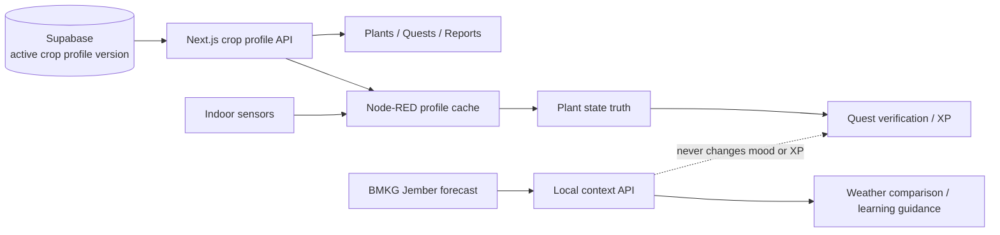

# PlantMoji · Jember 현지화 및 DB 기반 작물 프로필 구현 계획

작성 기준일: 2026-08-07  
대상: Jember 현지 교육용 키트, 3일 데모 스프린트 이후 현장 확장

## 현재 구현된 기반 (2026-08-07)

- Home, Quests, Badges/Collection, Plants, 공통 내비게이션과 Demo Control Center는 Bahasa Indonesia를 기본으로 사용하며 ID/EN 전환을 공유한다.
- `GET /api/local-context`는 Tegalgede의 공식 BMKG 마을 예보(기본 `35.09.21.1005`)를 30분 캐시하고 프로세스 내 마지막 성공값을 보존한다.
- Home은 BMKG를 Jember 실외 참고 정보로 표시하고 실내 식물 공간의 온도·습도를 별도 줄에 표시한다. BMKG 값은 무드·퀘스트·XP·하드웨어 동작에 사용하지 않는다.
- Settings는 현재 레벨·XP·스트릭·뱃지·스토리 장을 보여주며 `DEMO_CHEAT_CODE` 하나로 전체 해금과 안전한 게임 진행 초기화를 지원한다.
- 이 문서의 DB 기반 작물/사이트 레지스트리, 인도네시아 추가 작물, Node-RED 영속 재전송 큐는 후속 범위다.

## 1. 목표

PlantMoji를 단순히 Jember 지명을 사용하는 데모가 아니라 다음 조건을 만족하는 현지 교육용 키트로 만든다.

1. 실제 재배 중인 딸기의 판정 기준을 유지하면서, Jember와 연관성이 높은 작물 프로필을 근거·버전과 함께 Supabase에 저장한다.
2. 웹, 퀘스트 검증, Node-RED가 DB의 동일한 활성 프로필을 사용한다.
3. Jember의 날씨와 계절은 BMKG 공식 데이터로 안내하되, 실내 화분의 실제 상태는 센서로만 판정한다.
4. 핵심 학습 화면은 Bahasa Indonesia로 이해할 수 있게 하고, 영어는 선택 가능한 보조 언어로 유지한다.
5. 인터넷이 불안정해도 Arduino와 Node-RED의 로컬 안전 동작은 유지하고, 웹에는 마지막 측정 시각과 오프라인 상태를 명확하게 표시한다.
6. 학생이 `예측 → 측정 → 행동 → 센서 검증 → 회고`를 한 수업 안에서 경험하게 한다.

## 2. 변경하면 안 되는 원칙

- 실제 데모 화분은 계속 일반 딸기(`Fragaria × ananassa`)다.
- 자동 급수, 자동 비료 투입, 약품 투입은 이번 범위에 포함하지 않는다.
- BMKG의 실외 예보로 실내 식물의 무드, 퀘스트 완료, XP를 결정하지 않는다.
- 온도·습도·pH·조명 기준은 작물과 생육 단계의 생물학적 기준이다. Jember라는 이유만으로 임계값을 임의 보정하지 않는다.
- LDR 0/1은 밝음/어두움만 뜻한다. lux, 광량, DLI 충족으로 표현하지 않는다.
- 근거가 부족한 작물은 DB에 `draft`로만 저장하고 Plants 화면의 선택 목록에는 노출하지 않는다.
- 프로필 버전이 바뀌어도 과거 센서, XP, Bond, 퀘스트 기록은 재계산하지 않는다.
- AI는 설명 문구만 만들 수 있고 임계값, 센서 유효성, 하드웨어 명령을 결정하지 않는다.

## 3. 현재 상태와 실제 빈틈

이미 구현됨:

- `strawberry` 코드 레지스트리와 `plants.crop_profile_key`
- 작물 프로필 API, Plants 화면, 프로필 기반 퀘스트 회복 판정
- Node-RED의 60초 프로필 동기화와 strawberry cold-start fallback
- `Asia/Jakarta` 시간대
- Jember 배경의 스토리, 일일 이벤트, 고정 달력 기반 우기/건기 이벤트
- 센서 오프라인 이벤트와 주간 리포트 제외 규칙

추가로 필요한 것:

- 프로필 메타데이터·임계값·출처·버전을 DB의 관리 가능한 데이터로 전환
- Indonesian 농업 자료와 POLIJE 검토를 거친 추가 작물
- Bahasa Indonesia 런타임 UI
- BMKG 공식 예보와 실제 실내 센서의 비교 안내
- 현지 농업 지식 인터뷰를 저장할 출처/동의 구조
- Vercel API 장애 시 Node-RED 이벤트의 영속 재시도
- 수업 전 리셋, QR 접속, 관찰 기록을 포함한 교사용 운영 흐름

## 4. 데이터 책임 구조

판정의 진실은 `실내 센서 + 활성 작물 프로필`이다. BMKG 데이터는 설명과 수업 컨텍스트에만 사용한다.

## 5. 작물 우선순위와 조사 상태

아래 수치는 DB에 바로 운영값으로 확정할 값이 아니라, 공식 자료에서 추출해 검토를 시작할 **연구 후보값**이다.

| 우선순위 | 안정 키 | 작물·생육 단계 | 현재 확인된 후보 범위 | 결정 |
|---|---|---|---|---|
| P0 | `strawberry` | 일반 딸기, 품종 미상 | 현재 v1: 권장 20–24°C, 허용 15–27°C, RH 40–60%, pH 5.5–6.5. Indonesian Kementan 자료는 10–30°C, 최적 27°C를 제시해 기존 시설재배 자료와 차이가 있음 | 현재 v1을 유지해 데모 회귀를 막고, 현지 실측과 품종 확인 후에만 v2 검토 |
| P1 | `melon` | 포트/greenhouse 멜론 | 25–30°C, 이상적 RH 약 60%, 환기 시 70–80%에서도 생육 가능, pH 6.0–7.0, 일조 10–12시간 | POLIJE Smart Green House 교육과 연결성이 높음. 2개 자료와 현지 교수/기술자 검토 후 첫 추가 활성 후보 |
| P1 | `chili` | cabai merah 또는 cabai rawit 중 한 종·품종 확정 필요 | Kementan 자료에서 토양 pH 5.5–6.8, 32°C 초과 시 생식 생장 위험 후보가 확인됨. 습도·광 기준은 자료 간 교차검증 필요 | `chili`라는 뭉뚱그린 이름으로 활성화하지 말고 종/품종을 확정할 때까지 draft |
| P2 | `robusta_coffee_seedling` | Robusta 커피 묘목 | 자료별 온도 21–24°C 또는 24–30°C, pH 5.5–6.5. 묘목 단계 RH·차광 기준 추가 조사 필요 | Jember 대표성은 높지만 현재 binary LDR로 차광률을 판정할 수 없어 advisory/draft |
| P2 | `cacao_seedling` | 카카오 묘목 | 최소 18–21°C, 최대 30–32°C 후보. 묘목 단계 RH·pH·차광 기준 추가 조사 필요 | Puslitkoka/POLIJE 검토 전 draft |

이번 3일 안에 활성 프로필을 무리하게 늘리지 않는다. 목표는 `strawberry`를 DB 기반 운영 프로필로 안전하게 옮기고, `melon`과 `chili`를 검토 가능한 draft 데이터로 만드는 것이다.

### 당장 제외할 작물

- `tobacco`: Jember 대표성은 있지만 청소년 교육용 키트의 첫 확장 작물로 적절하지 않고 실내 화분 프로필 검증도 부족하다.
- `rice`: 논 조건을 표현하려면 토양 수분이 아니라 수위/담수 상태 센서가 필요하다.
- `coffee`/`cacao` 성목: 현재 키트 크기와 수업 기간에 맞지 않는다. 묘목 프로필로만 별도 연구한다.

## 6. 출처와 승인 규칙

프로필 버전 하나를 `active`로 바꾸려면 다음을 모두 통과해야 한다.

1. 작물의 scientific name과 생육 단계가 확정되어 있다.
2. 온도, 공기습도, 토양 pH, 광 조건마다 출처가 매핑되어 있다.
3. 최소 2개 자료가 있고, 그중 1개 이상은 Indonesian 정부·공공 연구기관 또는 원 연구 논문이다.
4. 자료 간 범위가 다르면 넓게 합치지 않고 차이의 원인(품종, 생육 단계, 노지/시설)을 기록한다.
5. POLIJE 농업 전공 교수, 연구자 또는 담당 기술자가 검토자와 날짜를 남긴다.
6. 현재 센서로 측정할 수 없는 기준은 `null` 또는 `advisory_only`로 남긴다. 값을 추정해서 채우지 않는다.
7. 경계값 단위 테스트와 Node-RED 재동기화 테스트를 통과한다.

프로필 출처에는 `supports_metrics`를 저장한다. 예를 들어 한 자료가 pH만 뒷받침하면 온도·습도 출처로 재사용하지 않는다.

## 7. Supabase 데이터 모델

새 additive migration: `supabase/milestone8-local-crop-profiles.sql`

### `crop_profiles`

프로필의 안정적인 정체성과 표시 정보를 보관한다.

| 컬럼 | 타입 | 설명 |
|---|---|---|
| `key` | text PK | `strawberry`, `melon`, `chili` 등 변경되지 않는 키 |
| `scientific_name` | text | 학명 |
| `growth_stage` | text | `general`, `seedling`, `fruiting` 등 |
| `display_names` | jsonb | `{ "en": "Melon", "id": "Melon" }` |
| `variety_label` | jsonb | 품종 또는 `unknown` 안내 |
| `status` | text check | `draft`, `active`, `retired` |
| `created_at`, `updated_at` | timestamptz | 감사용 시각 |

### `crop_profile_versions`

임계값을 수정하지 않고 새 버전으로 누적한다.

| 컬럼 | 타입 | 설명 |
|---|---|---|
| `profile_key` | text FK | `crop_profiles.key` |
| `version` | integer | 프로필 내부 단조 증가 버전 |
| `schema_version` | integer | JSON 계약 버전 |
| `criteria` | jsonb | 온도·공기습도·토양 pH·조명 판정값 |
| `guidance` | jsonb | EN/ID 일반 안내와 제한사항 |
| `capabilities` | jsonb | 센서별 `verified`, `advisory_only`, `unavailable` |
| `is_active` | boolean | 프로필당 하나만 true가 되도록 partial unique index |
| `reviewed_by` | text nullable | POLIJE 검토자 |
| `reviewed_at` | timestamptz nullable | 검토 시각 |
| `published_at` | timestamptz nullable | 활성화 시각 |

기본키는 `(profile_key, version)`이다. 활성화하려면 `crop_profiles.status = 'active'`, `is_active = true`, 검토 정보가 모두 있어야 한다.

### `crop_profile_sources`

| 컬럼 | 타입 | 설명 |
|---|---|---|
| `profile_key`, `profile_version` | composite FK | 근거가 적용되는 정확한 버전 |
| `title`, `publisher`, `url` | text | 출처 |
| `source_kind` | text | `government_guide`, `research_paper`, `local_expert` |
| `supports_metrics` | text[] | `temperature`, `air_humidity`, `soil_ph`, `light` |
| `notes` | text | 범위 차이와 적용 조건 |
| `accessed_on` | date | 조회일 |

### `site_profiles`

작물 기준과 장소 정보를 분리한다.

| 컬럼 | 타입 | 설명 |
|---|---|---|
| `key` | text PK | `jember-polije` |
| `display_name` | text | 설치 장소 표시 |
| `timezone` | text | `Asia/Jakarta` |
| `locale` | text | `id-ID` |
| `bmkg_adm4_code` | text | 실제 설치 kelurahan/desa 확인 후 입력 |
| `latitude`, `longitude` | numeric nullable | 표시/검증용, 비밀값 아님 |

`plants.site_profile_key`를 nullable FK로 추가하고 `plant-01`에는 `jember-polije`를 설정한다. BMKG 행정코드는 POLIJE의 실제 설치 위치를 확인한 뒤 넣으며 추측하지 않는다.

### 권한과 안전

- 활성 프로필과 출처는 anon 읽기를 허용해 웹에서 표시할 수 있다.
- 쓰기는 service role 또는 migration으로만 허용한다.
- 3일 버전에서는 관리자 편집 UI를 만들지 않는다. SQL migration과 코드 리뷰가 승인 경계다.
- API는 DB의 JSON을 그대로 신뢰하지 않고 기존 `CropProfile` 계약으로 파싱·범위 검증한다.
- DB 조회 실패 시 검증된 코드 내장 `strawberry v1`만 fallback한다.

## 8. 애플리케이션 변경

### 8.1 프로필 저장소

- `src/lib/crop-profile-repository.ts`를 추가해 활성 목록, 특정 버전, plant의 현재 프로필을 조회한다.
- 기존 `src/lib/crop-profiles.ts`는 타입, 파서, 환경 판정 함수와 frozen strawberry fallback만 보유한다.
- 임의 문자열 저장을 금지하고 `active` 프로필 키만 Plants 서버 액션에서 허용한다.
- `species`는 선택한 프로필의 표시명에서 계속 파생해 호환 필드로 저장한다.

### 8.2 API

- `GET /api/crop-profiles`: 선택 가능한 활성 프로필의 요약 목록을 반환한다.
- 기존 `GET /api/crop-profile?plantId=plant-01`: DB 활성 버전과 출처 요약을 반환하도록 확장한다.
- 응답에 `profile.key`, `profile.version`, `criteria`, `capabilities`, `timezone`, `sourceSummary`, `fetchedAt`을 포함한다.
- `DEVICE_API_TOKEN` 인증 계약과 404/401 동작은 유지한다.
- 미설정 식물은 strawberry로 정규화하되 DB 장애와 잘못된 profile key는 로그에서 구분한다.

### 8.3 Plants 화면

- `active` 프로필만 선택 가능하게 표시한다.
- 작물 카드에 Bahasa/English 이름, 학명, 생육 단계, 버전, 검토 상태를 표시한다.
- 각 센서 항목에 `Optimal / Low / High / Waiting`과 함께 “왜 이 기준인가?” 출처 링크를 제공한다.
- `advisory_only` 항목은 무드나 퀘스트를 만들지 않는다고 명시한다.
- 프로필 변경은 기존 XP, Bond, 스트릭, 배지, 기록, 진행 퀘스트를 초기화하지 않는다.

### 8.4 퀘스트와 Node-RED

- 퀘스트 회복 판정은 plant가 실제로 참조한 profile version을 사용한다.
- Node-RED는 시작 시와 60초마다 API를 조회하고 `(key, version)`이 달라질 때만 `flow.cropProfile`을 교체한다.
- 새 프로필은 다음 유효 센서 샘플부터 적용한다.
- 일시 실패 시 마지막 성공 버전을 유지하고, cold start에서만 frozen strawberry v1을 사용한다.
- 프로덕션 API 주소는 두 POST 노드의 하드코딩 URL 대신 `PLANTMOJI_API_URL`로 통일한다.
- API 전송 실패 이벤트는 eventId를 보존해 로컬 영속 큐에 넣고 지수 backoff로 재전송한다. 하드웨어 제어 경로와는 계속 병렬이어야 한다.

## 9. Jember 현지 기능

### 9.1 BMKG Local Context

- BMKG 공개 예보 API를 서버에서 호출한다: `adm4`는 `site_profiles.bmkg_adm4_code`를 사용한다.
- BMKG API의 3일/3시간 단위 예보와 갱신 시각을 저장하고 화면에 BMKG 출처를 표시한다.
- 30분 캐시와 마지막 성공 응답을 사용한다. 실패 시 “예보 갱신 대기 중”으로 표시하며 가짜 날씨를 만들지 않는다.
- 홈에는 다음처럼 실외와 실내를 분리해 표시한다.
  - `Jember outdoor forecast: 30°C / 82% RH`
  - `Plant room sensor: 27.8°C / 67% RH`
- 안내 예시: “오늘 Jember는 덥게 예보됐지만, Jamkachu의 상태는 실내 센서로 확인해요.”
- 날씨는 교육 카드와 관리 팁에만 사용하고 무드, quest, XP, hardware control 입력에는 넣지 않는다.

### 9.2 Bahasa Indonesia 우선 레이어

3일 안에는 사용 빈도가 높은 다음 문자열부터 적용한다.

- Home: mood, speech bubble, sensor name/status, current quest, connection state
- Quests: 해야 할 행동, 검증 카운트다운, 완료 결과
- Plants: 권장 범위, 일반 가이드, 품종 차이 안내
- Monitoring: 온도, kelembapan udara, pH tanah, cahaya, 마지막 측정 시각

언어 선택은 로그인 없는 데모에 맞춰 `localStorage`에 `id`/`en`을 저장한다. 문서용 3개 언어 Markdown을 런타임 번역 시스템으로 재사용하지 않는다. AI를 사용할 때도 선택 언어를 prompt에 전달하며 실패 시 같은 언어의 deterministic template으로 fallback한다.

### 9.3 현지 지식과 수업

- 현재 `farmer-wisdom.ts`의 placeholder는 실제 Jember 농민 또는 POLIJE 전문가 인터뷰로 교체한다.
- 인터뷰마다 이름 공개 동의, 역할/지역, 녹취 또는 메모, 번역 검수, 연결 센서를 기록한다.
- 이름 공개 동의가 없으면 익명 출처로 표시한다.
- 수업 미션은 `예측 → 측정 → 행동 → 검증 → 한 줄 회고` 다섯 단계로 구성한다.
- 학생이 직접 물을 주거나 환기하더라도 XP는 센서가 회복을 확인했을 때만 지급한다.

## 10. 3일 실행 계획

팀의 역할을 새로 복잡하게 만들지 않고, 기존 TL 3명이 작업 트랙을 하나씩 맡는다. KL·ML·PL은 코딩 트랙을 기다리지 않고 같은 시간에 검증 자료를 만든다.

### Day 1 — DB와 근거 고정

**TL-A · DB/API**

- milestone8 migration 작성
- strawberry v1과 기존 출처를 DB에 seed
- melon/chili는 `draft`로 seed
- repository + JSON validator + DB fallback 단위 테스트

**KL 2명**

- Kementan 자료에서 metric별 근거 표 작성
- strawberry의 기존 해외 시설재배 범위와 Indonesian 자료 차이 기록
- POLIJE 검토자에게 melon/chili의 종·품종·생육 단계 확인

**완료 조건:** DB 장애가 나도 strawberry v1 데모가 유지되고, draft 프로필은 선택할 수 없다.

### Day 2 — 화면·현지 컨텍스트·디바이스

**TL-B · Web**

- Plants를 DB 목록으로 전환
- Home/Quests/Plants 핵심 Bahasa 문자열 적용
- `/api/local-context`와 BMKG 카드 구현

**TL-C · Node-RED/Deployment**

- `PLANTMOJI_API_URL=https://main-plant-moji.vercel.app` 기반 URL 전환
- 프로필 version 변경과 last-good fallback 확인
- POST 실패 영속 큐의 최소 구현 및 재전송 테스트

**ML 2명**

- BMKG/실내 센서가 혼동되지 않는 카드 시안
- Bahasa 문장이 작은 Android 화면과 프로젝터에서 잘리는지 검수
- 반쪽 A4 QR 접속 안내 제작

**완료 조건:** Vercel에서 plant-01 프로필과 센서 상태가 보이고, 네트워크 단절이 하드웨어 경로를 막지 않는다.

### Day 3 — 통합 검증과 수업 리허설

**PL 2명**

- 15분 수업/데모 순서 고정
- 3–5명의 Indonesian 사용자로 무설명 테스트 진행
- 발견 사항을 “데모 차단 / 이후 개선”으로만 분류

**전체 팀**

- Happy → Overheating → quest → recovery countdown → XP → level-up E2E
- 프로필 변경 → 60초 이내 Node-RED 동기화 → 다음 샘플 재판정
- BMKG 실패, Supabase 실패, 센서 offline, Node-RED 재시작 리허설
- lint, 전체 테스트, build, 모바일/프로젝터 시각 회귀 확인

**완료 조건:** 비전공 팀원이 문서 없이도 “현재 상태, 해야 할 행동, 센서 검증, 보상”을 Bahasa로 설명할 수 있다.

### 하루 두 번만 공유

- 오전 10분: 오늘의 한 문장 결과, 막힌 결정 1개
- 저녁 15분: 각 트랙이 실제 화면 또는 실제 센서로 2분 시연
- 긴 개발 설명 대신 `입력 → 화면 변화 → DB/센서 증거` 세 가지만 보여준다.

## 11. 테스트 계획

### DB/프로필

- active profile은 프로필당 정확히 한 버전만 존재
- draft/retired key 저장 거부
- criteria 누락, NaN, min > max, 잘못된 hysteresis 활성화 거부
- `plants.crop_profile_key` FK와 `species` 파생 저장 확인
- strawberry v1 DB 값과 frozen fallback의 deep equality 확인
- 프로필 변경이 XP, Bond, streak, badge, growth record를 변경하지 않음

### API/캐시

- 정상 응답, 인증 실패, unknown plant, unknown site
- DB 실패 시 strawberry cold fallback
- BMKG 성공, timeout, 잘못된 JSON, stale cache, 출처 표시
- 날씨 응답이 mood 또는 quest result를 바꾸지 않는 회귀 테스트

### UI

- 센서 없음/정상/낮음/높음/오래됨 상태
- id/en 전환과 새로고침 후 언어 유지
- 긴 Bahasa 문장의 360px 화면 overflow 검사
- source link, profile version, draft 비노출 확인

### Node-RED/E2E

- API 성공, 일시 실패, 재시작 후 큐 재전송, 동일 eventId 중복 무해성
- profile API 실패 시 last-good 유지
- 새 version 수신 후 다음 센서 샘플부터 재판정
- 게임 API가 죽어도 LCD/RGB/buzzer/servo와 Supabase 센서 저장이 계속 동작
- 실제 Vercel URL에서 `/api/device-events`와 `/api/crop-profile` 검증

## 12. 이번 3일의 범위 밖

- 작물 프로필을 웹에서 자유 편집하는 관리자 CMS
- BMKG 예보 기반 자동 제어 또는 XP 보상
- 카메라 질병 진단
- 실제 lux/DLI 판정
- 논 수위, 토양 EC, 영양액 자동 투입
- 여러 학교/반/학생 계정과 랭킹
- 근거가 검토되지 않은 coffee/cacao 프로필의 활성화

## 13. 후속 단계

### P1 · 1–2주

- POLIJE 검토를 받은 melon 또는 확정된 chili 한 종을 active로 승격
- 전체 런타임 Bahasa 번역과 공통 dictionary 정리
- local context cache를 Supabase에 영속화
- 수업 세션과 학생 회고 기록 export
- 농민/전문가 인터뷰 3건을 Wisdom 카드로 반영

### P2 · 현장 연구

- robusta coffee/cacao 묘목의 생육 단계별 프로필 실험
- lux 센서 도입 후 shade/photoperiod 기준 확장
- site와 device 다중 등록
- 장기 센서 데이터와 성장 기록의 상관 분석
- BMKG 예보와 실내 센서 차이를 이용한 기후 적응 수업 모듈

## 14. 공식 자료 출발점

- Jember 2025–2029 RPJMD: Jember의 주요 농업·플랜테이션 작물로 padi, tobacco, coffee, cacao를 설명  
  https://ppid.jemberkab.go.id/storage/dokumen/2025/TA50/1764231429-rpjmd-2025-2029.pdf
- Kabupaten Jember Dalam Angka 2025, BPS Jember  
  https://jemberkab.bps.go.id/id/publication/2025/02/28/0b6aa001308d7457d545932f/jember-regency-in-figures-2025.html
- BMKG 공개 3일 예보 API 계약과 attribution 요구사항  
  https://data.bmkg.go.id/prakiraan-cuaca/
- POLIJE의 실습 중심 농업 교육 및 Smart Green House melon 현장  
  https://polije.ac.id/pmb/  
  https://polije.ac.id/polije-buka-paket-agrowisata-inovatif-di-tengah-kota-jember/
- Kementan Pedoman Budi Daya Stroberi  
  https://repository.pertanian.go.id/handle/123456789/23667
- Kementan Petunjuk Teknis Produksi dan Pengelolaan Benih Melon  
  https://repository.pertanian.go.id/bitstreams/3427688a-d256-4fc5-92f5-01947139499e/download
- Kementan Teknologi Budidaya Cabai Merah  
  https://repository.pertanian.go.id/bitstreams/efe030a2-b074-4585-9353-91aa14159f05/download
- Kementan GAP Kopi Robusta  
  https://repository.pertanian.go.id/server/api/core/bitstreams/5f2d737f-37b9-4995-8e04-0ea188e1f238/content
- Kementan Modul Pelatihan Teknis Budidaya Kakao  
  https://repository.pertanian.go.id/bitstreams/ff99a138-1ceb-4be5-92bf-876786fa9c43/download

## 15. Ringkasan pelaksanaan untuk tim Indonesia

- Nilai ambang tanaman disimpan di Supabase dengan versi dan sumber; hanya profil berstatus `active` yang boleh dipilih.
- Cuaca BMKG Jember hanya untuk konteks belajar, bukan untuk menentukan mood, quest, XP, atau kontrol hardware.
- Hari 1: pindahkan strawberry v1 ke DB dan simpan melon/cabai sebagai draft.
- Hari 2: hubungkan Plants/API/Node-RED, tampilkan Bahasa Indonesia, dan tambahkan kartu BMKG vs sensor ruangan.
- Hari 3: uji demo penuh dan kondisi gagal jaringan/sensor.
- Melon/cabai baru boleh diaktifkan setelah nama spesies/tahap tumbuh jelas, minimal dua sumber tersedia, dan reviewer pertanian POLIJE menyetujui.
- Kopi robusta dan kakao tetap draft sampai syarat bibit, kelembapan, dan naungan dapat diukur dengan sensor kit.
